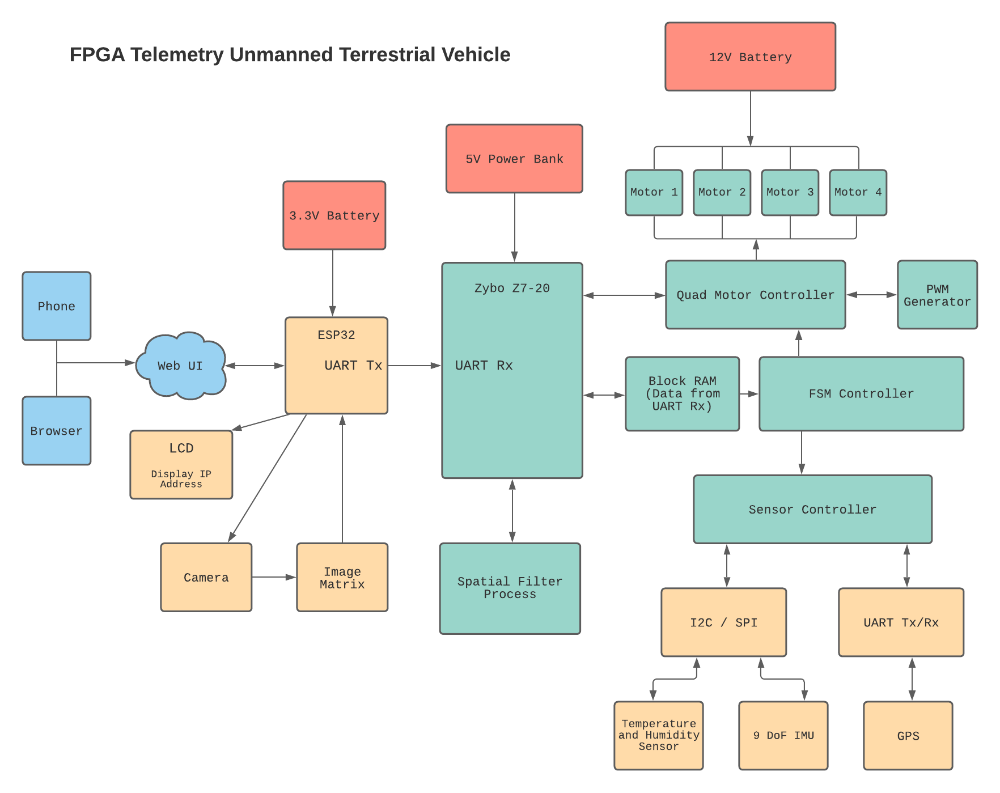

# Description
Implemented in VHDL, this project aims to achieve the following goals:
- Establish UART between a microcontroller (ESP32) and an FPGA/SoC board such as the Zybo Z7-20
- Using the ESP32's Wi-Fi capability, a web UI is created that will allow the user to control the robot wirelessly
    - i.e. There will be no need to maintain connection between the computer and the FPGA board
    - The ESP32 will be programmed using either C or C++. It will provide an IP address that can be used to connect to the web UI, which will be designed using HTML/CSS
    - Depending on the user's input from the web UI, a corresponding function for the given command will be called. This will trigger the ESP32 to transmit data to the Zybo
- Alternative Option for ESP32: Raspberry Pi
    - The Raspberry Pi will be programmed using Python. A module called `serial` will be used in order to transmit and receive bytes of data via UART
    - Flask will be used to handle the web server, and the web UI is designed using HTML/CSS
- Design a motor controller that instantiates multiple instances of a PWM generator to control four DC motors. The motor controller will include features such as speed control and changing directions
- Design a sensor controller that will interface one or two of the following sensors: (1) Temperature and Humidity, (2) 9 DoF IMU, (3) GPS, and (4) Ultrasonic Range Finder
    - The communication protocols involved will be: I2C, SPI, or UART
- Design a top-level FSM controller that will send signals to both the motor and the sensor controllers based on the data received via UART
- Image Processing: Apply a spatial filter to an image
    - Several filters can be applied to the original image such as an averaging filter, edge detection (Laplacian of Gaussian), or a smoothing filter
    - A camera will be connected to either the ESP32 or the Raspberry Pi and capture a still photo
    - The image matrix will be sent via UART to the FPGA and stored in a Block RAM. Then, the FPGA will process the incoming data and apply a spatial filter
    - The resulting matrix will be sent back via UART, and the output image will be compared alongside the original image

# Block Diagram of Design

# Parts
| Part | QTY | Price ($) | Link |
| --- | --- | --- | --- |
| Zybo Z7-20 FPGA/SoC | -- | -- | --
| FireBeetle ESP32 Microcontroller | 1 | 6.90 per unit | [Product Link](https://www.dfrobot.com/product-1590.html)
| 12V 170 RPM DC Gear Motor | 4 | 15.00 per unit | [Product Link](https://www.servocity.com/170-rpm-econ-gear-motor/)
| Dual Channel DC Motor Driver | 2 | 22.00 per unit | [Product Link](https://www.robotshop.com/en/cytron-10a-5-30v-dual-channel-dc-motor-driver.html)
| 12V 3000mAh NiMH Battery | 1 | 35.00 per unit | [Product Link](https://www.servocity.com/nimh-battery-12v-3000mah-xt30-connector-mh-fc-20a-fuse-12-20/)
| GPS Option 1: GPS Breakout - NEO-M9N, SMA (Qwiic) | 1 | 70.00 per unit | [Product Link](https://www.sparkfun.com/products/17285)
| Humidity and Temperature Sensor | 1 | 10.00 per unit | [Product Link](https://www.sparkfun.com/products/13763)
| 9DoF IMU Breakout | 1 | 17.00 per unit | [Product Link](https://www.amazon.com/SparkFun-Breakout-ICM-20948-connection-Accelerometer-Magnetometer/dp/B07VNV3WKL/)
| 3604 Series Omni Wheel (14mm Bore, 120mm Diameter) | 4 | 9.00 per unit | [Product Link](https://www.servocity.com/3604-series-omni-wheel-14mm-bore-120mm-diameter/)

# Development Tools
* Software: Vivado
* Languages: VHDL, C++, C, Python, MATLAB
* Development Board Used: Zybo Z7-20, ESP32, Raspberry Pi

# Contributors
* Jose Martinez
* Aaron Nanas

# TODO:
* Update README after finalizing microcontroller choice
    * Verify if web server is working via Flask\
* Finalize chassis: mecanum wheels, overall structure, batteries
