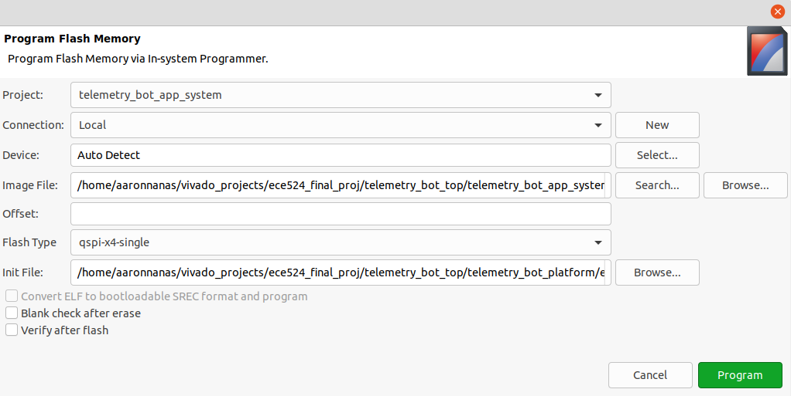

# Directory Tree
- `components`: Contains all the lower level modules used
- `fpga_telemetry_bot_main`: The primary directory that contains the project's Vivado files. Specifically, the VHDL files can be found in the following path: `fpga_telemetry_bot_main/telemetry_bot_top/telemetry_bot_top.srcs/sources_1/new`
- `MATLAB Scripts`: Contains the MATLAB project files, initially used to generate the sample image matrix and view the results after the sample image has been processed by the spatial filters
- `raspberry_pi_web_ui`: Contains all the files for the Raspberry Pi, including the Python Flask app that serves the Web UI. The `templates` directory includes the HTML file, while the `static` directory consists of the CSS file, the input image directory, and the `image_results_for_ui` directory which is used to store the output images
    - `app.py` is used to run the Flask application
- `schematics`: Contains the synthesized RTL schematic of each component
- `screenshots`: Contains all the image files used for the project repository
- `simulation_results`: Includes some simulation results of the lower-level components

# FPGA Telemetry Robot

# Description

Implemented in VHDL, this project aims to achieve the following goals:

- Establish UART between an external device (which could be a microcontroller or a processor) such as a Raspberry Pi and an FPGA/SoC board such as the Zybo Z7-20

- Using the Raspberry Pi's Wi-Fi capability, a web UI is created that allows the user to send signals to the FPGA wirelessly via UART. The FPGA will then perform the associated actions according to the instructions specified by the user.
    - The Raspberry Pi will be programmed using Python. A module called `serial` will be used in order to transmit and receive UART data streams
    - The web UI is designed using HTML/CSS/Javascript, with Flask serving as the web framework

- Design a motor controller that instantiates multiple instances of a PWM generator to control four DC motors. The motor controller will include features such as speed control and changing directions

- Interface a servo motor that will control the position of the camera

- Interface an Ultrasonic Range Finder that will display the range in inches on the Pmod Seven-Segment Display

- Design a top-level FSM controller that will send signals to both the motor and the sensor controllers based on the data received via UART

- Image Processing: Apply a spatial filter to an image
    - Several filters can be applied to the original image such as an averaging filter, edge detection (Laplacian of Gaussian), or a smoothing filter
    - A camera will be connected to the Raspberry Pi and capture a still photo
    - The image matrix will be sent via UART to the FPGA and stored in a Block RAM. Then, the FPGA will process the incoming data and apply a spatial filter
    - The resulting matrix will be sent back via UART, and the output image will be compared alongside the original image

- To remove the need of programming the FPGA each time it is powered on, a Zynq Boot Image is created in order to store the bitstream and other necessary files into the Zybo Z7-20's QSPI Flash. After it boots up, the Zybo will read the contents of the QSPI Flash.

# Block Diagram of Design

# General Communication Diagram

# Parts
| Part | QTY | Price ($) | Link |
| --- | --- | --- | --- |
| Zybo Z7-20 FPGA/SoC | 1 | 299.00 per unit | [Product Link](https://digilent.com/shop/zybo-z7-zynq-7000-arm-fpga-soc-development-board/)
| Raspberry Pi 4B 8GB | 1 | 75.00 per unit | [Product Link](https://www.adafruit.com/product/4564)
| Arducam 5MP Camera | 1 | 9.99 per unit | [Product Link](https://www.amazon.com/dp/B012V1HEP4?ref=ppx_yo2_dt_b_product_details&th=1)
| 12V 170 RPM DC Gear Motor | 4 | 15.00 per unit | [Product Link](https://www.servocity.com/170-rpm-econ-gear-motor/)
| Adafruit DRV8871 DC Motor Driver Breakout Board | 4 | 7.50 per unit | [Product Link](https://www.adafruit.com/product/3190)
| HS-311 Servo-Stock Rotation | 1 | 13.49 per unit | [Product Link](https://www.servocity.com/hs-311-servo/)
| Pmod MAXSONAR: Maxbotix Ultrasonic Range Finder | 1 | 25.99 per unit | [Product Link](https://digilent.com/shop/pmod-maxsonar-maxbotix-ultrasonic-range-finder/)
| Pmod SSD: Seven-Segment Display | 1 | 6.99 per unit | [Product Link](https://digilent.com/shop/pmod-ssd-seven-segment-display/)
| Buck Converter (5V 1.6A) | 1 | 2.90 per unit | [Product Link](https://www.dfrobot.com/product-1768.html)
| 12V 3000mAh NiMH Battery | 1 | 35.00 per unit | [Product Link](https://www.servocity.com/nimh-battery-12v-3000mah-xt30-connector-mh-fc-20a-fuse-12-20/)
| 5V Power Bank | 1 | 18.95 per unit | [Product Link](https://www.adafruit.com/product/4288)
| Metal Mecanum Wheel with Motor Shaft Coupling (Left and Right) | 4 | 8.90 per unit | [Product Link](https://www.dfrobot.com/product-2301.html)

# Mecanum Wheels Chart
The following reference was used to determine the drive directions of the robot.

For reference, the register that determines the motor direction and the PWM enable signals consists of the following decimal values based on the specified directions:

- Move Forward: 63
- Move Backward: 207
- Move Left: 175
- Move Right: 95
- Move Diagonal Backward-Left: 201
- Move Diagonal Backward-Right: 198
- Move Diagonal Forward-Left: 54
- Move Diagonal Forward-Right: 57

# Development Tools
* Software: Vivado
* Languages: VHDL, Python, MATLAB, HTML/CSS/Javascript
* Development Board Used: Zybo Z7-20, Raspberry Pi

# Contributors
* Jose Martinez
* Aaron Nanas

# References
## General Design Ideas
- [OpenCores](https://opencores.org/projects)
    - **Note**: Requires an account to download design files
## UART
- [ECE UNM UART Slides](http://ece-research.unm.edu/jimp/vhdl_fpgas/slides/UART.pdf)
- [Nandland: UART, Serial Port, RS-232 Interface](https://www.nandland.com/vhdl/modules/module-uart-serial-port-rs232.html)

## VGA Controller
- [Pmod VGA by Digilent](https://digilent.com/reference/pmod/pmodvga/start?redirect=1)

# Testing Strategies
### VGA
- After the VGA controller has been written, verify its functionality by outputting several colors
    - Create patterns such as rainbows or several blocks of different colors divided into sections
    - Consult a [12-Bit Color Code](https://rangevoting.org/ColorCode2.html) tool to obtain hex values for RGB
    - Observe how `h_sync_counter` and `v_sync_counter` are mapped onto the screen
- Obtain a 12-bit RGB image matrix and output it on the screen

### Suggested Values for VGA Timing

| Resolution Format | Pixel Clock | H Front Porch Width | H Pulse Width | H Max | V Front Porch Width | V Pulse Width | V Max |
| --- | --- | --- | --- | --- | --- | --- | --- |
| 1920 x 1080 @ 60 Hz | 148.5 MHz | 88 | 44 | 2200 | 4 | 5 | 1125 |
| 1280 x 1024 @ 60 Hz | 108 MHz | 48 | 112 | 1688 | 1 | 3 | 1066 |
| 1280 x 720 @ 60 Hz | 74.25 MHz | 110 | 40 | 1650 | 5 | 5 | 750 |

# Creating the Zynq Boot Image for Zybo Z7-20
General Procedure:

1. Add all the design source files and the associated constraints file of the development being used. Click `Create Block Design` under IP Integrator. Then add the ZYNQ7 Processing System. Hit `Run Block Automation`. Then, connect `FCLK_CLK0` to the port `M_AXI_GP0_ACLK`. 

2. Double-click on the ZYNQ7 Processing System, select Clock Configuration, click the drop-down for PL Fabric Clocks, and change the frequency of `FCLK_CLK0` to 125 MHz. Note that this clock will be connected to the clock of the RTL design.

3. Right-click on the Block Design area and select `Add Module...`. Choose all the design sources in the project. For the I/O ports, right-click on them (can be done individually) and select `Make External`. Note that this will add a suffix to the names of your I/O, so rename the ports by removing this suffix (in our case, it was `_0` as necessary). In other words, any I/O ports must match their names as listed in the constraints file.

4. Another note: for reset, if this is declared in the constraints file, manually set the reset signal external, as this will be automatically connected to the ZYNQ7 Processing System's reset port.

5. Validate the Block Diagram design and save it.

6. Then, under Sources > IP Sources, right-click on the Block Diagram design (the default name is usually `design_1`). Select `Generate Output Products...`. Then, right-click on it again and select `Create HDL Wrapper`.

7. After it has created the wrapper, select `Generate Bitstream.` After the bitstream has been written, select File > Export > Export Hardware. Make sure to hit the `Include Bitstream` option. The next page will generate the name of the XSA wrapper and will indicate where it will be exported to.

8. Launch the Vitis IDE. Then, select File > New > Platform Project. After the platform has been created, click on `Modify BSP Settings...` and check the box for `xilffs`, which will allow the Generic Fat File System Library to be used. This library is necessary for creating the application for the Zynq FSBL.

Platform Setup:

Configuring xilffs:

9. Build the platform project by right-clicking on the top-level section and selecting `Build Project`. Once it has finished building, create the application by selecting File > New > Application Project. Choose the platform previously created. Then, specify the name of the application project.

10. In the `Templates` section, choose `Zynq FSBL` from the available templates. Then hit `Finish`.

11. Make sure that the app system is highlighted. Then, to create the boot image: select Xilinx > Create Boot Image. For Vitis IDE under Vivado 2020.2, the output paths for the `.bif` and `.bin` files are automatically selected. Moreover, the bootloader and the bitstream file should already be added under the `Boot image partitions` pane. If not, add these manually. Press `Create Image` when done.

12. Once an image has been successfully created, head over to Xilinx > Program Flash. Make sure that your board is turned on and the jumper has been set to JTAG mode. By default, the jumper is set to QSPI. Then, hit `Program`. This will load the contents of your project as a Zynq boot image to the QSPI Flash.

13. After it has finished programming the board, turn the board's power off and set the jumper back to QSPI. Then, turn on the board. This should load the boot image from the QSPI Flash. Done!

# Zynq Boot Image Block Design

# FPGA Resources

The following figures present the FPGA resources used.

