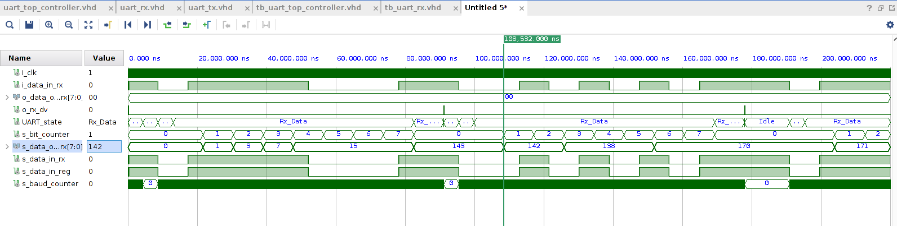
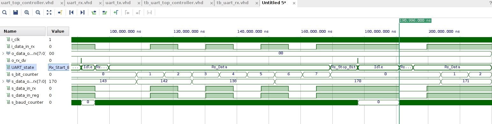
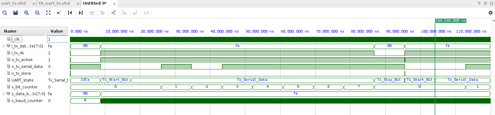
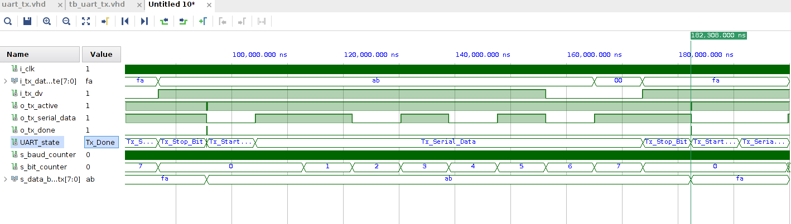
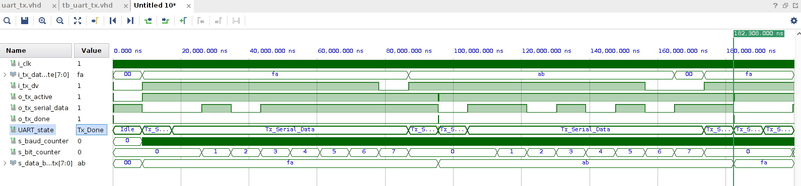
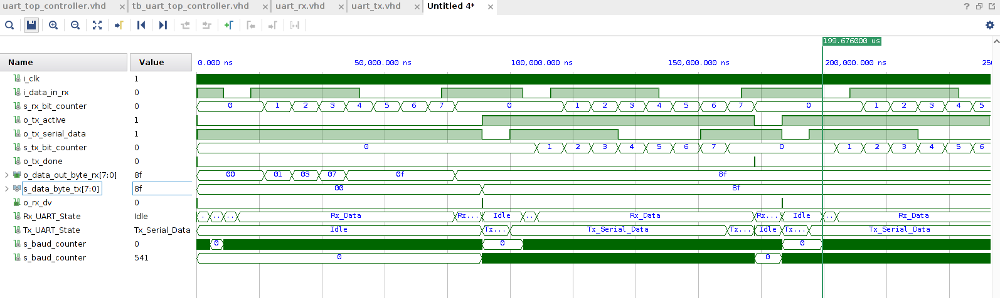
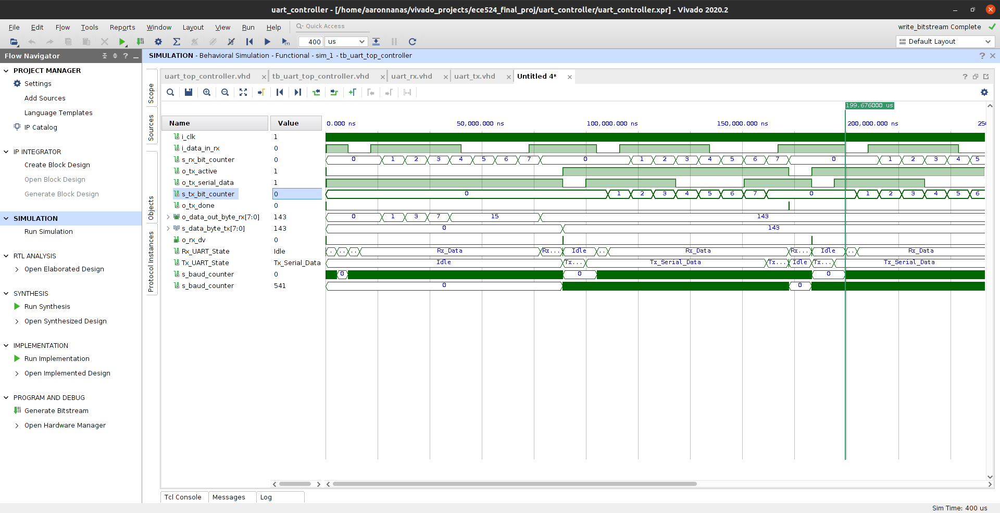
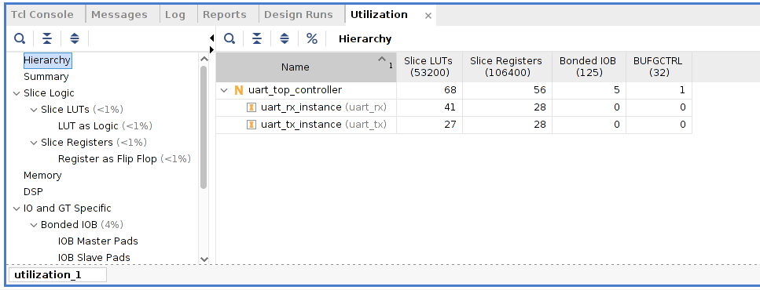

# UART Simulation Results

## Testing Strategies
- Wrote the testbench code for simulation
- Viewed UART data stream using an oscilloscope by inspecting the Raspberry Pi's Tx pin
- Displayed data received by the FPGA in hexadecimal form using a Pmod Seven-Segment Display

## UART Rx

### Test Case 1: Receiving Vector of "10001111"

### Test Case 2: Receiving Vector of "10101010"

## UART Tx

### Test Case 1: Serially Transmitting 0xFA

### Test Case 2: Serially Transmitting 0xAB

Full Waveform for both test Tx test cases:

## Top-Level UART

### Test Case: Receiving and Transmitting 0x8F

Full Waveform Results of UART Rx/Tx:

## FPGA Resources Used for Top-Level UART

- LUTs: 68
- FFs: 56

